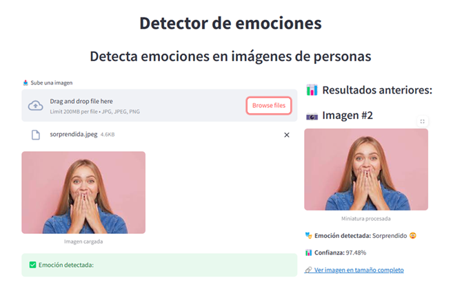

# Detector de Emociones en Imágenes

Esta es una aplicación desarrollada en **Streamlit** que utiliza **AWS Rekognition** para detectar emociones en rostros humanos presentes en imágenes.

  

## Funcionalidades

- Subir imágenes de personas en formato `.jpg`, `.jpeg` o `.png`
- Procesamiento en la nube con Rekognition vía API Gateway + Lambda
- Detección de emociones principales
- Visualización del resultado con:
  - Nombre de la emoción (en español)
  - Emoji representativo
  - Porcentaje de confianza
- Historial visual de imágenes procesadas

---

## Demo en línea

Puedes probar la aplicación en Streamlit Cloud:  
🔗 [https://rekogemocionesaws.streamlit.app](https://rekogemocionesaws.streamlit.app)

---

## 🛠️ Requisitos

Este proyecto necesita Python 3.7+ y las siguientes dependencias:

